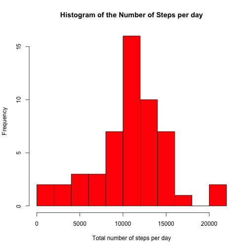
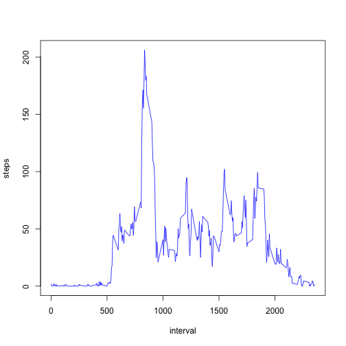
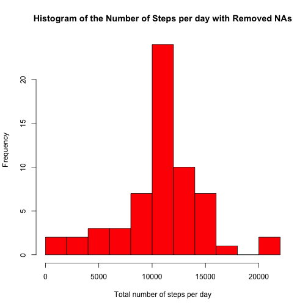
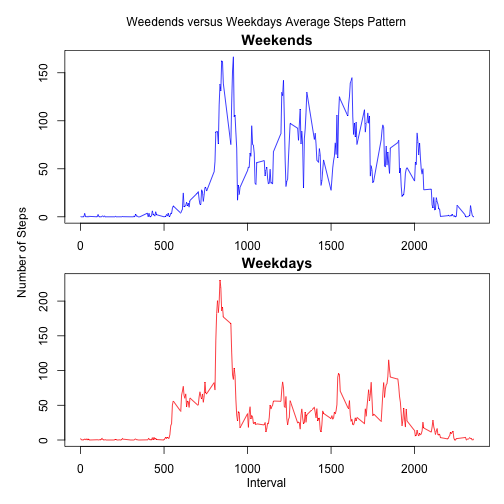

## Loading and preprocessing the data


```r
steps <- read.csv("activity.csv")
steps$date <- as.Date(steps$date)
```

## What is mean total number of steps taken per day?

We calculate the number of steps taken each day by grouping them by day. Then, we create a histogram to display the frequencies of how many steps are given per day.


```r
Sys.setlocale("LC_TIME","en_US")  #sets the language to english to avoid issues with 
```

```
## [1] "en_US"
```

```r
                                  #systems running in differnet languages

totalStepsPerDay <- aggregate(list(steps = steps$steps), 
                              by=list(date = steps$date),
                              FUN=sum)

hist(totalStepsPerDay$steps, 
     col="red",
     breaks=10,
     main = "Histogram of the Number of Steps per day",
     xlab = "Total number of steps per day"
     )
```

 

```r
stepsPerDayMean <-  mean(totalStepsPerDay$steps,na.rm=TRUE)
stepsPerDayMedian <- median(totalStepsPerDay$steps,na.rm=TRUE)
```

In order to calculate the mean and the median, we use the grouped data, ignoring the values not available(NAs), and apply the proper statistical funcitons. The median was calculated as 10765 and the mean as 1.0766 &times; 10<sup>4</sup>.


## What is the average daily activity pattern?

In order to understand the daily activity pattern, we grouped the databaset by the number of the 5 minutes interval  in which the steps measurement was taken. When aggregating, we averaged the steps of a time interval accross all days of measurement. 

Then, we ploted a time series of the intervals.


```r
avarageIntervals <- aggregate(list(steps = steps$steps), 
                              by=list(interval = steps$interval), 
                              FUN=mean, 
                              na.rm=TRUE)

plot(avarageIntervals,type="l",
     col="blue",
     ylabel="mean of steps accross all days")
```

```
## Warning: "ylabel" não é um parâmetro gráfico
## Warning: "ylabel" não é um parâmetro gráfico
## Warning: "ylabel" não é um parâmetro gráfico
## Warning: "ylabel" não é um parâmetro gráfico
## Warning: "ylabel" não é um parâmetro gráfico
## Warning: "ylabel" não é um parâmetro gráfico
```

 

Than we identify the interval in which the average number of steps was higher. 


```r
maxInterval <- avarageIntervals[ avarageIntervals$steps == max(avarageIntervals$steps) , ]
```

The interval 835 is the one in which the maxium of steps was found, resulting in an average of 206.1698 in this 5 minutes time interval across all days of measurement. 


## Imputing missing values

The original dataset contains a total number of **2304** measurements not avalable (NAs). This may introduce a bias in the calculations. So we decided to replace all NAs in the dataset with the mean of the same 5 minutes time interval accros all days.

In order to accomplish that, we loop through all rows in the dataset with NA values and replace them by the average of the time interval.


```r
completeSteps <- steps
for(x in which(sapply(completeSteps$steps, is.na)) ) { 
     completeSteps[x,]$steps <- round(avarageIntervals[ avarageIntervals$interval==completeSteps[x,]$interval, ]$steps)
}
```

After processing the NAs, we redo the analisys calcultaing the total number of steps per day.


```r
completeTotalStepsPerDay <- aggregate(list(steps = completeSteps$steps), 
                              by=list(date = completeSteps$date),
                              FUN=sum)

hist(completeTotalStepsPerDay$steps, 
     col="red",
     breaks=10,
     main = "Histogram of the Number of Steps per day with Removed NAs",
     xlab = "Total number of steps per day"
     )
```

 

```r
completeStepsPerDayMean <-  mean(completeTotalStepsPerDay$steps)
completeStepsPerDayMedian <- median(completeTotalStepsPerDay$steps)
```

This time, we obtained a average of **1.0766 &times; 10<sup>4</sup>** and a median of **1.0762 &times; 10<sup>4</sup>**, compared with the values mean 1.0766 &times; 10<sup>4</sup> and median 10765, obtained before processing the NA.

Yet we can observe an increase in the frequency in the histogram, what could be expected considering the filled NA values, we don't see any impact in the mean of the number of steps per day and a small impact in the median.

## Are there differences in activity patterns between weekdays and weekends?

In order to investigate this question we created a timesering comparing the total number of steps in weekdays and weekends. 

To accomplish that, first we process the data creating a new column in the dataset, classifying dates between weekdays and weekends. Based on this new column, we split we dataset in 2 subsets.


```r
completeSteps$weekperiod <- as.factor(ifelse(weekdays(completeSteps$date) %in% c("Saturday","Sunday"), "weekend", "weekday")) 

weekdaysSteps <- completeSteps[completeSteps$weekperiod=="weekday",]
weekendsSteps <- completeSteps[completeSteps$weekperiod=="weekend",]
```

Than we group each subset by the number of the 5 minutes time interval.


```r
weekdaysAvarageIntervals <- aggregate(list(steps = weekdaysSteps$steps), 
                                      by=list(interval = weekdaysSteps$interval), 
                                      FUN=mean)


weekendsAvarageIntervals <- aggregate(list(steps = weekendsSteps$steps), 
                                      by=list(interval = weekendsSteps$interval), 
                                      FUN=mean)
```

Finally, we plot both time series in a panel plot.


```r
par(mfrow = c(2, 1),oma = c(2, 2, 2, 0),mar=c(2,2.5,1.5,1))


plot(weekendsAvarageIntervals,type="l",
     col="blue",
     main="Weekends")

plot(weekdaysAvarageIntervals,type="l",
     col="red",
     main="Weekdays")

mtext("Weedends versus Weekdays Average Steps Pattern",side=3, outer = TRUE)
mtext("Number of Steps",side=2,outer = TRUE)
mtext("Interval",side=1,outer = TRUE)
```

 

By comparing the 2 plots, it is possible to observe  a general increase of activity during weekends, specially during the period around midday and afternoon. 

However, if we compare the only the time segment before 10am (time interval number 1000), we can see a small decrease in the number of steps during weekends when compared to weekdays, suggesting that people walk shorter distances during this specific time interval in weekends.
